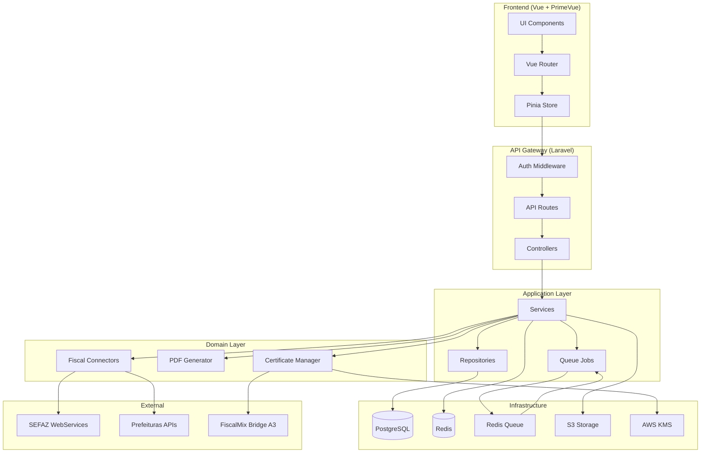
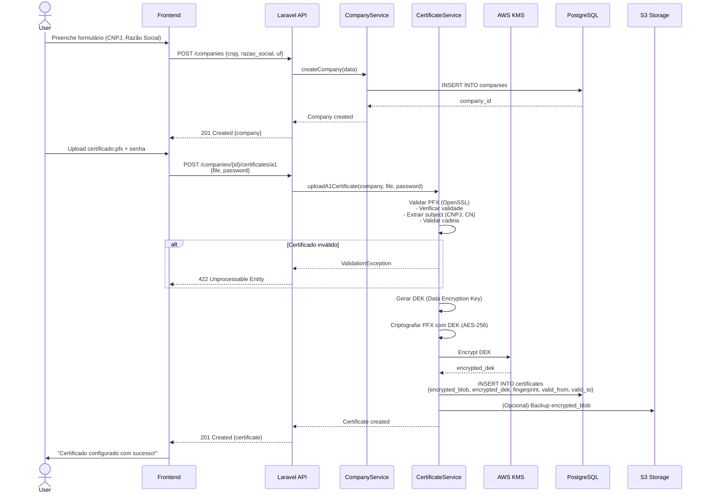
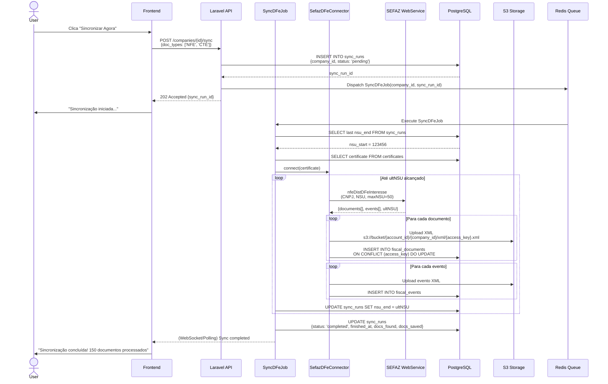
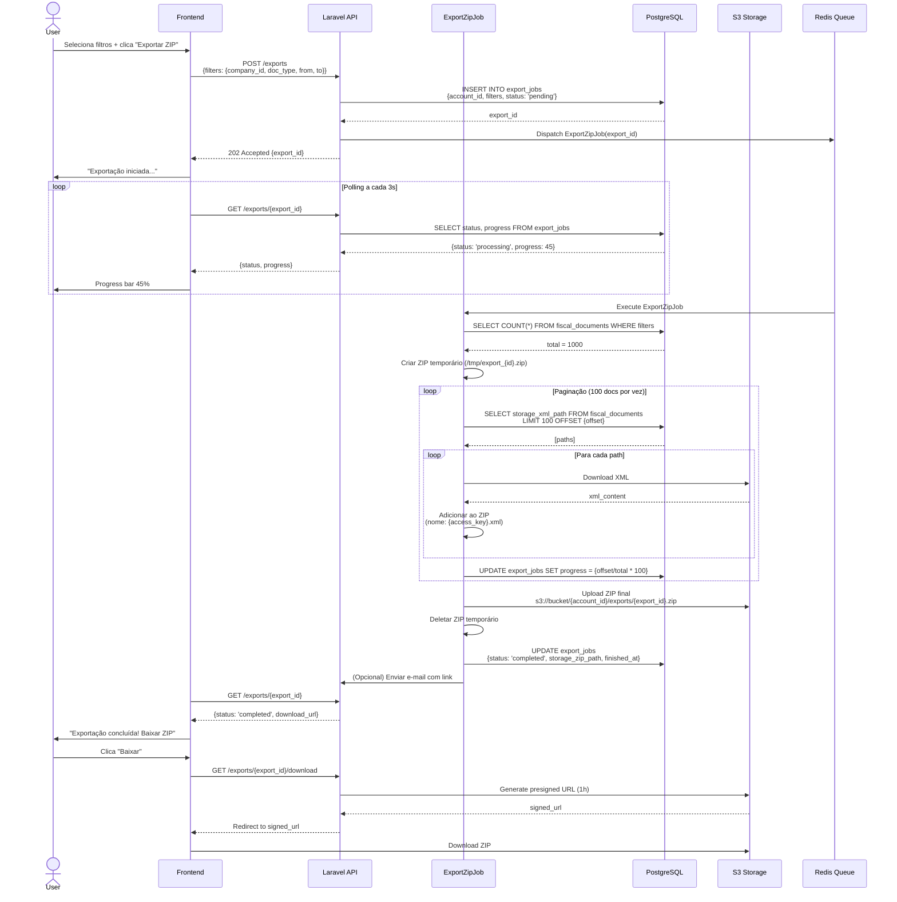
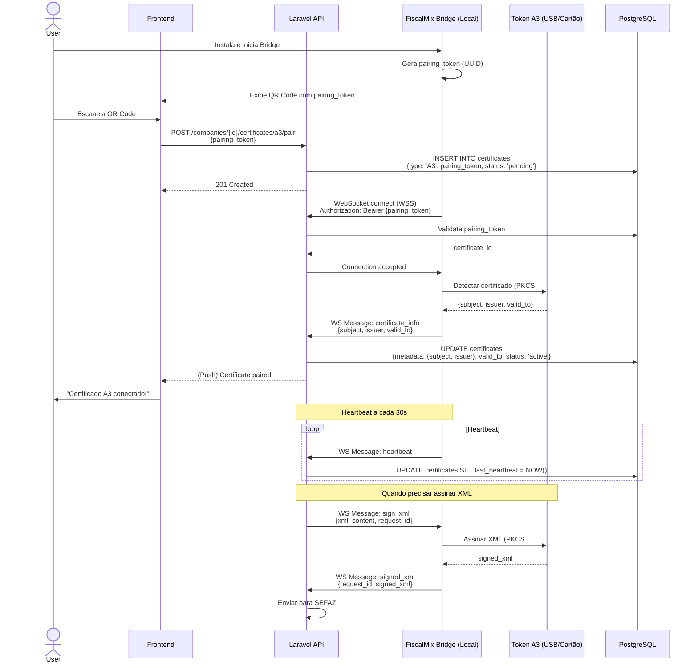
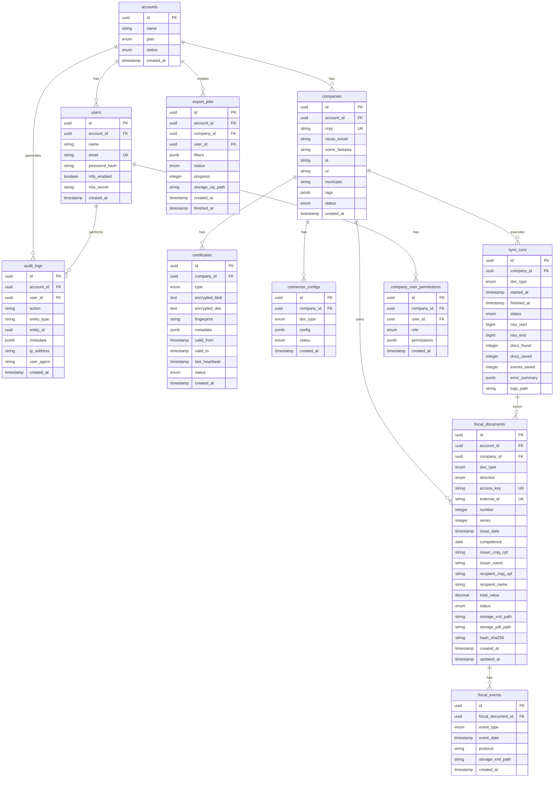

# FiscalMix - Arquitetura Técnica Detalhada

## 1. Stack Tecnológico

### Backend
- **Framework**: Laravel 11 (PHP 8.3)
- **Database**: PostgreSQL 16
- **Cache/Queue**: Redis 7
- **Storage**: AWS S3 (ou MinIO para dev)
- **Jobs**: Laravel Horizon (Redis-based queue)
- **Criptografia**: AWS KMS / Laravel Encryption

### Frontend
- **Framework**: Vue 3 (Composition API + TypeScript)
- **UI Library**: PrimeVue 3.x
- **Build**: Vite 5
- **State**: Pinia
- **HTTP**: Axios
- **Router**: Vue Router 4

### Infraestrutura
- **Containers**: Docker + Docker Compose
- **Reverse Proxy**: Nginx
- **Monitoring**: Prometheus + Grafana
- **Logs**: Laravel Log (JSON) → ELK Stack
- **CI/CD**: GitHub Actions

---

## 2. Diagrama de Componentes



---

## 3. Fluxos de Dados Detalhados

### 3.1 Fluxo: Cadastro de Empresa + Upload Certificado A1



---

### 3.2 Fluxo: Sincronização SEFAZ DF-e (NSU Incremental)



---

### 3.3 Fluxo: Exportação ZIP em Lote



---

### 3.4 Fluxo: Certificado A3 via FiscalMix Bridge



---

## 4. Modelo de Dados (PostgreSQL)

### 4.1 Diagrama ER



### 4.2 Tabelas Detalhadas (SQL)

```sql
-- accounts
CREATE TABLE accounts (
    id UUID PRIMARY KEY DEFAULT gen_random_uuid(),
    name VARCHAR(255) NOT NULL,
    plan VARCHAR(50) NOT NULL DEFAULT 'free' CHECK (plan IN ('free', 'starter', 'professional', 'enterprise')),
    status VARCHAR(50) NOT NULL DEFAULT 'active' CHECK (status IN ('active', 'suspended', 'cancelled')),
    created_at TIMESTAMP NOT NULL DEFAULT NOW(),
    updated_at TIMESTAMP NOT NULL DEFAULT NOW()
);

CREATE INDEX idx_accounts_status ON accounts(status);

-- users
CREATE TABLE users (
    id UUID PRIMARY KEY DEFAULT gen_random_uuid(),
    account_id UUID NOT NULL REFERENCES accounts(id) ON DELETE CASCADE,
    name VARCHAR(255) NOT NULL,
    email VARCHAR(255) NOT NULL UNIQUE,
    password_hash VARCHAR(255) NOT NULL,
    mfa_enabled BOOLEAN NOT NULL DEFAULT FALSE,
    mfa_secret VARCHAR(255),
    email_verified_at TIMESTAMP,
    created_at TIMESTAMP NOT NULL DEFAULT NOW(),
    updated_at TIMESTAMP NOT NULL DEFAULT NOW()
);

CREATE INDEX idx_users_account_id ON users(account_id);
CREATE INDEX idx_users_email ON users(email);

-- companies
CREATE TABLE companies (
    id UUID PRIMARY KEY DEFAULT gen_random_uuid(),
    account_id UUID NOT NULL REFERENCES accounts(id) ON DELETE CASCADE,
    cnpj VARCHAR(14) NOT NULL,
    razao_social VARCHAR(255) NOT NULL,
    nome_fantasia VARCHAR(255),
    ie VARCHAR(50),
    uf CHAR(2) NOT NULL,
    municipio VARCHAR(100),
    tags JSONB DEFAULT '[]',
    status VARCHAR(50) NOT NULL DEFAULT 'active' CHECK (status IN ('active', 'inactive')),
    created_at TIMESTAMP NOT NULL DEFAULT NOW(),
    updated_at TIMESTAMP NOT NULL DEFAULT NOW(),
    UNIQUE(account_id, cnpj)
);

CREATE INDEX idx_companies_account_id ON companies(account_id);
CREATE INDEX idx_companies_cnpj ON companies(cnpj);
CREATE INDEX idx_companies_status ON companies(status);

-- certificates
CREATE TABLE certificates (
    id UUID PRIMARY KEY DEFAULT gen_random_uuid(),
    company_id UUID NOT NULL REFERENCES companies(id) ON DELETE CASCADE,
    type VARCHAR(10) NOT NULL CHECK (type IN ('A1', 'A3')),
    encrypted_blob TEXT, -- A1 only
    encrypted_dek TEXT, -- A1 only
    fingerprint VARCHAR(255),
    pairing_token VARCHAR(255), -- A3 only
    metadata JSONB DEFAULT '{}', -- {subject, issuer, etc}
    valid_from TIMESTAMP NOT NULL,
    valid_to TIMESTAMP NOT NULL,
    last_heartbeat TIMESTAMP, -- A3 only
    status VARCHAR(50) NOT NULL DEFAULT 'active' CHECK (status IN ('active', 'expired', 'revoked', 'pending')),
    created_at TIMESTAMP NOT NULL DEFAULT NOW(),
    updated_at TIMESTAMP NOT NULL DEFAULT NOW()
);

CREATE INDEX idx_certificates_company_id ON certificates(company_id);
CREATE INDEX idx_certificates_valid_to ON certificates(valid_to);
CREATE INDEX idx_certificates_status ON certificates(status);

-- connector_configs
CREATE TABLE connector_configs (
    id UUID PRIMARY KEY DEFAULT gen_random_uuid(),
    company_id UUID NOT NULL REFERENCES companies(id) ON DELETE CASCADE,
    doc_type VARCHAR(10) NOT NULL CHECK (doc_type IN ('NFE', 'NFCE', 'CTE', 'MDFE', 'NFSE')),
    config JSONB NOT NULL DEFAULT '{}', -- {municipio, provedor, etc}
    status VARCHAR(50) NOT NULL DEFAULT 'active' CHECK (status IN ('active', 'inactive')),
    created_at TIMESTAMP NOT NULL DEFAULT NOW(),
    updated_at TIMESTAMP NOT NULL DEFAULT NOW(),
    UNIQUE(company_id, doc_type)
);

CREATE INDEX idx_connector_configs_company_id ON connector_configs(company_id);

-- fiscal_documents
CREATE TABLE fiscal_documents (
    id UUID PRIMARY KEY DEFAULT gen_random_uuid(),
    account_id UUID NOT NULL REFERENCES accounts(id) ON DELETE CASCADE,
    company_id UUID NOT NULL REFERENCES companies(id) ON DELETE CASCADE,
    doc_type VARCHAR(10) NOT NULL CHECK (doc_type IN ('NFE', 'NFCE', 'CTE', 'MDFE', 'NFSE')),
    direction VARCHAR(10) NOT NULL CHECK (direction IN ('issued', 'received')),
    access_key VARCHAR(44), -- NF-e/CT-e/MDF-e
    external_id VARCHAR(255), -- NFS-e ou outros
    number INTEGER NOT NULL,
    series INTEGER,
    issue_date TIMESTAMP NOT NULL,
    competence DATE, -- NFS-e
    issuer_cnpj_cpf VARCHAR(14) NOT NULL,
    issuer_name VARCHAR(255),
    recipient_cnpj_cpf VARCHAR(14),
    recipient_name VARCHAR(255),
    total_value DECIMAL(15,2) NOT NULL,
    status VARCHAR(50) NOT NULL, -- authorized, cancelled, denied, etc
    storage_xml_path VARCHAR(500) NOT NULL,
    storage_pdf_path VARCHAR(500),
    hash_sha256 VARCHAR(64) NOT NULL,
    created_at TIMESTAMP NOT NULL DEFAULT NOW(),
    updated_at TIMESTAMP NOT NULL DEFAULT NOW(),
    UNIQUE(access_key),
    UNIQUE(account_id, external_id, doc_type)
);

CREATE INDEX idx_fiscal_documents_account_company ON fiscal_documents(account_id, company_id);
CREATE INDEX idx_fiscal_documents_issue_date ON fiscal_documents(issue_date DESC);
CREATE INDEX idx_fiscal_documents_doc_type_status ON fiscal_documents(doc_type, status);
CREATE INDEX idx_fiscal_documents_direction ON fiscal_documents(direction);
CREATE INDEX idx_fiscal_documents_issuer ON fiscal_documents(issuer_cnpj_cpf);
CREATE INDEX idx_fiscal_documents_recipient ON fiscal_documents(recipient_cnpj_cpf);
CREATE INDEX idx_fiscal_documents_access_key ON fiscal_documents(access_key);
CREATE INDEX idx_fiscal_documents_external_id ON fiscal_documents(external_id);

-- fiscal_events
CREATE TABLE fiscal_events (
    id UUID PRIMARY KEY DEFAULT gen_random_uuid(),
    fiscal_document_id UUID NOT NULL REFERENCES fiscal_documents(id) ON DELETE CASCADE,
    event_type VARCHAR(50) NOT NULL, -- cancelamento, cce, manifestacao, etc
    event_date TIMESTAMP NOT NULL,
    protocol VARCHAR(50),
    storage_xml_path VARCHAR(500),
    created_at TIMESTAMP NOT NULL DEFAULT NOW()
);

CREATE INDEX idx_fiscal_events_document_id ON fiscal_events(fiscal_document_id);
CREATE INDEX idx_fiscal_events_type ON fiscal_events(event_type);

-- sync_runs
CREATE TABLE sync_runs (
    id UUID PRIMARY KEY DEFAULT gen_random_uuid(),
    company_id UUID NOT NULL REFERENCES companies(id) ON DELETE CASCADE,
    doc_type VARCHAR(10) NOT NULL,
    started_at TIMESTAMP NOT NULL DEFAULT NOW(),
    finished_at TIMESTAMP,
    status VARCHAR(50) NOT NULL DEFAULT 'pending' CHECK (status IN ('pending', 'running', 'completed', 'failed')),
    nsu_start BIGINT,
    nsu_end BIGINT,
    docs_found INTEGER DEFAULT 0,
    docs_saved INTEGER DEFAULT 0,
    events_saved INTEGER DEFAULT 0,
    error_summary JSONB,
    logs_path VARCHAR(500),
    created_at TIMESTAMP NOT NULL DEFAULT NOW(),
    updated_at TIMESTAMP NOT NULL DEFAULT NOW()
);

CREATE INDEX idx_sync_runs_company_id ON sync_runs(company_id);
CREATE INDEX idx_sync_runs_status ON sync_runs(status);
CREATE INDEX idx_sync_runs_started_at ON sync_runs(started_at DESC);

-- company_user_permissions
CREATE TABLE company_user_permissions (
    id UUID PRIMARY KEY DEFAULT gen_random_uuid(),
    company_id UUID NOT NULL REFERENCES companies(id) ON DELETE CASCADE,
    user_id UUID NOT NULL REFERENCES users(id) ON DELETE CASCADE,
    role VARCHAR(50) NOT NULL CHECK (role IN ('viewer', 'operator', 'admin')),
    permissions JSONB DEFAULT '{}',
    created_at TIMESTAMP NOT NULL DEFAULT NOW(),
    updated_at TIMESTAMP NOT NULL DEFAULT NOW(),
    UNIQUE(company_id, user_id)
);

CREATE INDEX idx_company_user_permissions_company ON company_user_permissions(company_id);
CREATE INDEX idx_company_user_permissions_user ON company_user_permissions(user_id);

-- audit_logs
CREATE TABLE audit_logs (
    id UUID PRIMARY KEY DEFAULT gen_random_uuid(),
    account_id UUID NOT NULL REFERENCES accounts(id) ON DELETE CASCADE,
    user_id UUID REFERENCES users(id) ON DELETE SET NULL,
    action VARCHAR(100) NOT NULL,
    entity_type VARCHAR(50),
    entity_id UUID,
    metadata JSONB DEFAULT '{}',
    ip_address INET,
    user_agent TEXT,
    created_at TIMESTAMP NOT NULL DEFAULT NOW()
);

CREATE INDEX idx_audit_logs_account_id ON audit_logs(account_id);
CREATE INDEX idx_audit_logs_user_id ON audit_logs(user_id);
CREATE INDEX idx_audit_logs_action ON audit_logs(action);
CREATE INDEX idx_audit_logs_created_at ON audit_logs(created_at DESC);

-- export_jobs
CREATE TABLE export_jobs (
    id UUID PRIMARY KEY DEFAULT gen_random_uuid(),
    account_id UUID NOT NULL REFERENCES accounts(id) ON DELETE CASCADE,
    company_id UUID REFERENCES companies(id) ON DELETE SET NULL,
    user_id UUID NOT NULL REFERENCES users(id) ON DELETE CASCADE,
    filters JSONB NOT NULL,
    status VARCHAR(50) NOT NULL DEFAULT 'pending' CHECK (status IN ('pending', 'processing', 'completed', 'failed')),
    progress INTEGER DEFAULT 0 CHECK (progress >= 0 AND progress <= 100),
    storage_zip_path VARCHAR(500),
    error_message TEXT,
    created_at TIMESTAMP NOT NULL DEFAULT NOW(),
    finished_at TIMESTAMP,
    updated_at TIMESTAMP NOT NULL DEFAULT NOW()
);

CREATE INDEX idx_export_jobs_account_id ON export_jobs(account_id);
CREATE INDEX idx_export_jobs_user_id ON export_jobs(user_id);
CREATE INDEX idx_export_jobs_status ON export_jobs(status);
CREATE INDEX idx_export_jobs_created_at ON export_jobs(created_at DESC);
```

---

## 5. Segurança e Deployment

Consulte o PRD para detalhes completos de segurança (envelope encryption, RLS, rate limiting) e configuração de deployment (Docker Compose, CI/CD).

---

## 6. Próximos Passos

1. **Implementar MVP** seguindo esta arquitetura
2. **Testes**: Unit (Services), Integration (Connectors), E2E (Cypress)
3. **CI/CD**: GitHub Actions para deploy automático
4. **Monitoramento**: Configurar Prometheus + Grafana
5. **Documentação**: OpenAPI/Swagger para API
